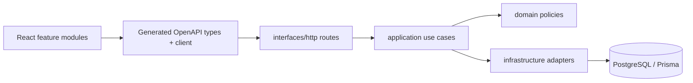

# 架構基線：TypeScript OpenAPI-first 模組化單體

## 決策

目前維持一個可部署 API 與一個 PostgreSQL schema，不拆微服務、不全面改寫為 NestJS，也不遷移 ASP.NET Core。先把邊界變得可測、可替換，再依實際負載判斷是否需要拆分。

## 後端依賴規則

- `domain/`：純規則與型別；不可匯入 Express、Prisma 或環境變數。
- `application/`：用例編排、scope query 與 transaction 邊界；可依賴 domain 及抽象化 infrastructure。
- `infrastructure/`：Prisma、JWT、bcrypt 與外部服務 adapter。
- `interfaces/http/`：路由、middleware 與 HTTP response mapping；不直接查 Prisma。
- `core/app.ts`：composition root，只負責掛載 adapter。

授權採兩層：平台角色決定可執行的用例，project membership 決定資料範圍。所有受保護請求都從資料庫重新載入角色與 `tokenVersion`，不信任 caller header 或 token 中的舊角色。

健康狀態分為兩個公開契約：`/health` 只表示 HTTP 程序存活；`/health/ready` 透過 infrastructure adapter 查詢 PostgreSQL，只有資料庫可服務時才回 200。部署依賴、容器 healthcheck、驗收腳本與 database-backed tests 一律使用 readiness，避免把「程序存在但資料層失效」誤判成可用。

## 前端依賴規則

- UI 元件所有權、互動狀態與響應式規則見 [UI 架構基線](ui-architecture.md)。
- route/page 透過 feature hook 取得資料，不保存正式路由的硬編碼 sample。
- feature service 使用 `src/shared/api/schema.d.ts` 的生成型別。
- `openapi.yaml` 是 HTTP 契約來源；CI 同時檢查 runtime operation、生成檔漂移、前後端 typecheck。

## 拆分觸發條件

只有當獨立擴縮、隔離故障、不同資料一致性模型或團隊所有權已可量測時，才把模組拆成服務。背景工作與 WebSocket 優先在相同 monorepo／application 模組上增加獨立 process，而不是先複製 domain model。
