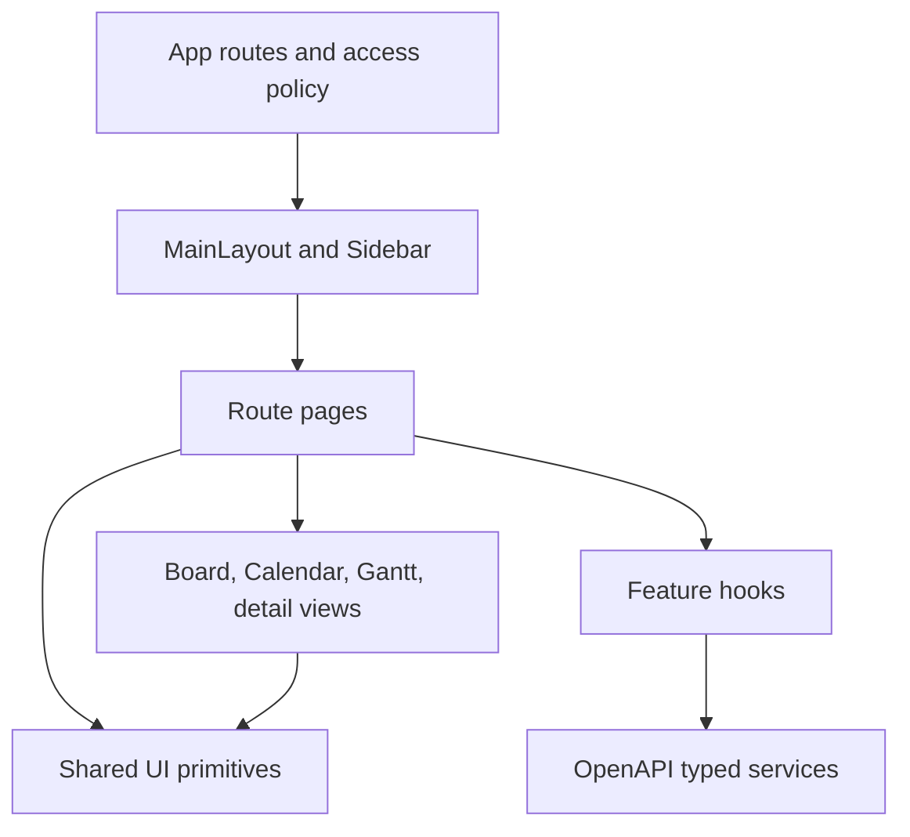

# UI 架構基線

本文件描述 `apps/web` 的 UI 邊界。視覺數值以根目錄 `DESIGN.md` 為準；這裡只定義元件所有權、資料流與擴充規則。

## 分層

- `components/ui/`：Button、Card、PageHeader、Alert、EmptyState、LoadingState、FormField、Badge、StatCard，以及共用 class builder。只處理呈現與可存取性，不呼叫 API。
- `components/layout/`：全域導覽、響應式殼層、行動抽屜與內容寬度。頁面不可自行複製側欄或 app shell。
- `MainLayout` 統一管理登入後 route 的可讀頁面名稱、document title 與輔助技術公告；頁面不得各自寫入互相衝突的標題。行動導覽開啟時鎖定背景捲動，關閉後還原原有 body 狀態。
- `pages/`：路由級版面與 feature component 組合；複合頁面的資料載入、操作狀態與回饋由 feature hook 擁有。已登入頁面採 route-level lazy loading。
- `components/*View.jsx`：可重用的領域視圖。資料與 mutation callback 由 page 或 feature hook 注入。
- `features/*`：正式資料流與 OpenAPI 型別；頁面不可繞過 service 直接組 URL。複合工作區以 feature hook 集中查詢與 mutation，再把資料與 callback 注入 presentational component。

### 正式產品平台基礎

- `shared/productPresentation.js` 是產品名稱、文件標題與平台角色文案的唯一來源；Shell、登入入口與設定頁不得再顯示 `Workspace` 或底層 `project_admin` 等技術值。
- 導覽分區以使用者工作心智呈現為「工作區、規劃與交付、洞察與治理、帳號與通知」，route 名稱仍由 `workspaceRoutePresentation.js` 集中管理。
- `shared/api/apiErrorPresentation.js` 是非登入 feature 的共用錯誤轉譯層；網路、401、403、5xx 與已知領域錯誤必須轉為穩定的產品文案，未知英文後端訊息回退到各操作的安全 fallback，不得直接暴露 `Failed to fetch`、`Unauthorized` 或內部驗證文字。
- Authentication 與可定位欄位錯誤可維持 feature 專用 presenter，但未知錯誤仍需委派共用 API 錯誤呈現層，確保工作階段與服務中斷語意一致。
- 正式 web client 只使用 OpenAPI transport，不打包記憶體 mock database、示範帳密或 demo 登入入口；靜態部署必須提供 `VITE_API_URL`，缺少正式 API 目標時建置流程應明確失敗。
- `components/layout/workspaceAccess.js` 是 route、側欄與 Home 快速入口的平台角色政策來源。GET 契約與工作區已支援唯讀時，viewer 必須能開啟畫面；寫入入口再由 `canAccessProject` 同時檢查平台角色、專案角色與封存狀態。只有 API 明確要求較高角色的 route（例如全域活動紀錄）才能在入口先提高門檻。

### Issue 工作區

- `pages/Tasks.jsx` 只負責路由、檢視模式與響應式組合；不得重新承擔 API 請求細節。
- `features/issue/useIssueWorkspace.ts` 是專案 Issue 清單、詳情、留言、指派與狀態流轉的資料所有者。
- `features/issue/useIssueRouteState.ts` 擁有 `?issue=` 深連結、行動版詳情開關、專案切換與清單／看板網址；切換檢視必須保留目前 Issue，移除選取時不得刪掉其他 query parameter。
- 判定深連結無效前必須確認目前專案的 Issue collection 已解析完成；不得在初次載入 effect 尚未開始時，以初始空陣列移除有效的 `?issue=`。
- 深連結指向不存在或不屬於目前專案的 Issue 時，需移除無效參數並顯示原地說明，不可讓網址與畫面靜默指向不同工作。
- Issue 清單、留言與活動查詢使用 latest-request guard；只允許目前專案／目前 Issue 的最新回應更新畫面，mutation 完成後的回饋也不得落到使用者已切換的新 Issue。
- `features/issue/components/` 擁有建立對話框、工作範圍工具列、Issue 清單與詳情呈現。
- `BoardView` 是共用看板投影；全域與專案內看板不得各自維護另一套卡片與欄位實作。
- `TaskDetailPanel` 是 Board、Calendar、Timeline 與專案總覽共用的詳情編輯器；草稿、欄位驗證、儲存狀態與未儲存離開確認不得散落到各 route page。
- `useProjectViewData` 必須分離專案清單與 Issue 載入狀態；切換專案時以請求序號忽略過期回應，避免舊專案資料覆蓋目前範圍。
- Issue view model 保留 `assignee` ID 供 mutation 與指標關聯，另由 `projectMemberPresentation` 投影 `assigneeLabel` 給看板；卡片不得在已有成員姓名時顯示技術性 user ID。
- 共用專案範圍載入失敗時由 `ProjectScopeSelector` 提供原地重試；固定專案總覽使用同一個 retry，不讓使用者只能重新整理整個瀏覽器。
- Board、Calendar、Timeline、Insights、Workload 共用 `ProjectScopedContent`，明確區分載入、錯誤、沒有可存取專案與正常內容；錯誤不得落成看似成功的空圖表。
- 跨專案詳情選取由 `useProjectTaskSelection` 擁有；專案範圍改變時清除舊 Issue，避免返回先前專案時意外重開詳情。

### Home 工作中心

- `pages/Home.jsx` 是登入後的工作入口，不是行銷 Landing Page；首屏優先呈現 My Tasks、Inbox、逾期風險與可存取專案。
- `features/home/useHomeWorkspace.ts` 組合 Dashboard、Project 與個人 Notification 契約，並集中重新整理與通知已讀 mutation。
- `features/home/components/` 擁有工作清單、收件匣與快速入口；Home page 只負責角色可見性與響應式版面組合。
- Home Inbox 使用與 Notifications 相同的事件轉譯與 Issue 深連結；逐列已讀 busy state、背景載入防競態與已讀覆寫規則不可在 Home 另做較弱版本。
- Home 禁止顯示固定的 preview KPI、假里程碑或無資料來源的健康狀態；缺資料時使用明確 loading、error 或 empty state。
- Home 連到 Issue 時必須帶入 `issue` query，讓桌面右欄或行動對話框直接開啟目標工作，而不是只回到清單第一筆。

### Dashboard 營運投影

- `pages/Dashboard.jsx` 只組合頁首、回饋與 dashboard feature components；`useDashboardWorkspace` 擁有查詢、資料正規化、重新整理、錯誤與更新時間。
- Dashboard 與 Home 共用 `features/dashboard/dashboardService.ts`，route page 不可直接依賴底層 service。
- 背景更新失敗時保留最後一份成功資料並明確顯示更新失敗；初次載入失敗則提供原地重試。
- 初次載入與背景重新整理共用 latest-request guard；只有目前最新的 Dashboard 請求能更新資料、時間與 busy state。
- 通知指標只計算目前使用者收件匣的未讀通知，需與 Notifications 頁的未讀數一致；平台角色不得讓個人指標改成其他使用者的通知總數。
- Issue 摘要必須連到帶有 `issue` query 的專案工作頁；超過清單上限時顯示總筆數，避免無提示截斷。
- 全域 Issue 摘要必須顯示專案代碼與名稱，不能只顯示可能跨專案重複的 `#Issue` 編號；Dashboard API view model 負責在存取範圍內補齊專案脈絡。
- 狀態分布依 workflow `order` 排列並由 API 提供可讀名稱；前端只對既有標準狀態套用本地化標籤，不以未知 status ID 當主要文字。
- 狀態分布使用具備 progressbar 語意的單一品牌色，不以額外顏色製造沒有契約依據的健康判斷。

### Projects 專案組合

- `pages/Projects.jsx` 只組合頁首、回饋區、專案 master-detail 與操作對話框；不得直接呼叫 `projectService`。
- `features/project/useProjectsWorkspace.ts` 擁有專案查詢、目前選取、權限衍生、建立／封存／里程碑／Sprint mutation，以及操作別錯誤狀態。
- 專案組合查詢使用 latest-request guard；較舊的重新整理或已卸載頁面回應不得覆寫目前清單。切換專案時一併清除上一個專案的操作回饋。
- `features/project/components/ProjectNavigator.jsx` 在桌面提供搜尋清單，在窄螢幕改用單一原生選擇器，避免清單與詳情形成過長頁面。
- 建立專案、快速規劃與封存使用個別原生 dialog；mutation 失敗時錯誤留在原操作脈絡並保留輸入。
- 已封存專案只顯示唯讀說明與既有統計；寫入入口必須同時通過平台角色、專案成員角色與專案狀態判定。
- `pages/ProjectDashboard.jsx` 只組合 route header、workspace state 與詳情面板；檢視 tabs、內容投影與 Issue 清單分別由 `ProjectViewTabs`、`ProjectWorkspaceContent`、`ProjectIssueList` 擁有。
- 專案檢視 tabs 使用 roving tabindex，支援左右方向鍵、Home、End 與焦點可見狀態；找不到或無權存取的專案不得繼續顯示空白看板。

### Project planning

- `pages/SprintManagement.jsx` 與 `pages/MilestoneManagement.jsx` 是薄 route wrapper；兩者共用 `ProjectPlanningWorkspace` 與 `useProjectPlanningWorkspace`。
- 完整規劃查詢與建立結果必須綁定 `projectId + kind` 範圍；切換專案、Sprint／里程碑或離開頁面後，過期回應不得更新目前清單、錯誤、成功提示或 saving 狀態。
- 快速規劃與完整管理共用 `ProjectPlanningDialog`；完整 Sprint 管理可補開始／結束日期，專案組合頁則保留低摩擦的名稱／目標流程。
- 建立型 dialog 在 mutation 期間透過 `closeDisabled` 同步鎖定 Esc、backdrop、標題列關閉與取消按鈕；可定位的專案代碼、成員 ID 與 Sprint 結束日期錯誤顯示在欄位下方並聚焦，草稿在失敗後保留。
- 後端目前只有建立能力，因此正式 route 不顯示編輯或刪除；增加 OpenAPI 契約與 service mutation 前不得以 local state 模擬持久化。
- 規劃卡片依日期排序並保留狀態、日期與目標詳情；所有寫入錯誤留在建立 dialog，清單載入錯誤則提供原地重試。
- viewer 與封存專案仍可從專案概況開啟既有里程碑／Sprint 清單；入口文案使用「查看全部」，並在工作區明示瀏覽模式，不可因無寫入權限而隱藏契約允許的讀取內容。

### Team 與專案權限

- `pages/TeamManagement.jsx` 只負責專案範圍、回饋與元件組合；`useTeamWorkspace` 擁有成員查詢、角色 mutation 與 RBAC 衍生狀態。
- 單一角色更新只鎖定該成員列；新增成員的錯誤留在 dialog 並保留輸入，不可用全頁 busy 狀態阻斷其他檢視。
- 使用者目錄 API 尚未提供時，介面必須明確說明需輸入完整使用者 ID，不得模擬帳號搜尋或顯示虛構姓名。
- 已封存專案的成員清單為唯讀；平台角色與專案內角色都通過 `canAccessProject` 後才顯示管理入口。

### Notifications 個人收件匣

- `pages/Notifications.jsx` 只組合頁首、篩選器、回饋與清單；`useNotificationsWorkspace` 擁有個人通知查詢、未讀衍生、重新整理、已讀 mutation 與自用提醒建立。
- `features/notification/notificationPresentation.ts` 是通知文案的唯一轉譯層；Notifications 與 Home Inbox 必須共用它，不可直接顯示後端 JSON payload。
- Issue 事件由 API view model 補上可讀的專案與 Issue 上下文；只有目前使用者可存取該專案時才能補全資料與產生深連結，任意自建 payload 不得成為跨專案探測入口。
- 有完整專案上下文的通知提供「查看 Issue」並保留 `?issue=`；開啟未讀通知會同步標示已讀。逐列已讀操作使用各自 busy 狀態，不能因一列更新而鎖定全部通知。
- 重新整理使用共用 latest-request guard，較舊的回應不得覆蓋較新的清單；已成功標示為已讀的本地狀態也不得被重疊的背景回應改回未讀。
- 清單背景重新整理失敗時保留既有資料；建立提醒的錯誤留在 dialog 並保留輸入，不得用頁首錯誤取代原操作脈絡。
- 後端尚未提供全部已讀、刪除或帳號目錄能力時，不顯示這些操作；一般使用者建立的提醒固定歸屬自己。

### Team 成員與權限

- `pages/TeamManagement.jsx` 只組合專案範圍、成員清單、角色說明與新增對話框；`useTeamWorkspace` 擁有查詢、成員 mutation、操作回饋與 stale-response 防護。
- `ProjectMember` API view model 必須從受存取控制的專案範圍補上成員名稱與 Email。團隊卡片及 Issue 指派共用同一個身分呈現規則，優先顯示可讀名稱與 Email，技術性 user ID 只保留為次要識別或舊資料 fallback。
- 成員角色更新採逐列 busy state，不得因一位成員正在儲存而鎖定其他列；新增成員使用獨立 pending 狀態。重複送出同一列需被阻止，不同成員可各自編輯。
- 專案清單查詢使用 latest-request guard；較舊的重新整理結果或已卸載頁面的回應不得覆寫目前畫面。

### Settings 帳號設定

- `pages/Settings.jsx` 只負責設定頁布局與密碼變更後導向；`useSettingsWorkspace` 分別管理個人資料與密碼操作的 pending、error、success 狀態。
- 個人資料與密碼表單各自保留草稿與錯誤，任一操作失敗不得覆蓋另一區的回饋；未變更資料時不開放送出。
- 可對應欄位的本地或 API 錯誤必須顯示在該欄位下方，設定 `aria-invalid`／`aria-describedby` 並把焦點移到第一個待修正欄位；只有無法歸屬欄位的錯誤才使用表單層 Alert。
- mutation 進行中鎖定該表單的輸入與送出，不阻斷另一張設定卡；完成前不得讓新草稿被舊回應覆蓋。
- 「目前密碼錯誤」是欄位驗證失敗，後端以 422 回覆；401 只保留給缺少、無效或過期 token，避免 auth transport 誤觸 refresh 或登出。
- 新密碼在送出前共用註冊密碼政策並要求再次確認；成功後後端撤銷既有 token，前端登出並回到登入頁。
- 角色摘要只說明目前契約回傳的角色與權限，不提供沒有 OpenAPI mutation 支援的角色切換。

### Authentication 入口

- Login 與 Register 可直接使用 `features/auth/authService.ts`，但共用憑證政策與錯誤訊息轉譯，不在 route page 複製英文 API 錯誤。
- `AuthLayout` 統一設定登入與註冊頁的 document title，避免登出後殘留上一個工作區 route 的頁面名稱。
- 註冊必須要求確認密碼並在送出前比對；欄位變更時清除已過時錯誤，提交期間鎖定重複操作。
- Login／Register 的本地驗證與可定位 API 錯誤使用 `FormField` 顯示在對應欄位，設定 `aria-invalid`／`aria-describedby` 並聚焦第一個錯誤；無法安全歸屬單一欄位的登入失敗才使用表單 Alert。
- route guard 透過同一個 auth external store 訂閱登入狀態；transport 在 access token 過期或受保護契約回傳 401 時，以 single-flight refresh 避免平行請求重複換發並重送原請求。refresh token 過期、撤銷或回傳 401 才清除整組 session；網路／伺服器暫時失敗保留 session 供重試，避免失效 token 把訪客頁擋回持續報錯的登入後頁面。
- 不可恢復的 session 需在登入頁說明已過期，並透過 route state 保留原始受保護路徑；重新登入成功後返回中斷位置。手動登出與首次訪問登入頁不得誤顯示過期提示。

### Activity 全域活動紀錄

- `pages/ActivityLogView.jsx` 是全域活動 route，只組合摘要、篩選器與清單；`useActivityWorkspace` 擁有查詢、重新整理、篩選、排序與計數衍生。
- `features/activity/activityPresentation.ts` 將 before／after JSON 轉為可閱讀的欄位變更；畫面不可顯示或截斷原始 JSON。
- `/activity-logs` 的 UI view model 同時提供操作者名稱／Email、專案名稱／代碼、Issue 編號／標題與深連結必要 ID；清單優先顯示這些可讀資訊，只在舊資料缺少上下文時退回原始 ID。
- 每筆活動以 `專案代碼 · #Issue 編號` 與 Issue 標題建立清楚層級，並提供至少 44px 的「查看 Issue」操作；目標網址必須保留 `?issue=` 直到目前專案 collection 完成解析。
- 初次查詢與背景重新整理共用 latest-request guard；較舊的成功或錯誤回應都不得覆蓋最新活動流。
- 目前 `/activity-logs` 契約回傳使用者可存取專案的全域紀錄，因此頁面不得暗示已套用單一專案篩選；需要專案篩選時應先擴充契約。
- 變更值在窄螢幕採上下排列，在桌面採前後對照；未知欄位使用中性摘要，不臆造不存在的資料。

### Issue 工作流程詞彙

- `features/issue/workflowPresentation.js` 是狀態與優先級顯示名稱、語意色彩及表單選項的唯一產品詞彙層；看板、詳情、清單、首頁、儀表板與活動紀錄不得各自維護翻譯表。
- Issue view model、分組、指標與 mutation 一律使用契約的 `statusId`；中文 label 只用於呈現，不可再以 `Todo`、`In Progress`、`Done` 等顯示文字反查或提交狀態。
- 標準 `todo`／`doing`／`done` 顯示為中文；契約提供的自訂狀態保留後端名稱與排序，讓新增工作流程不必修改元件。
- 看板拖曳 payload、狀態選單 value 與詳情儲存皆傳穩定 ID；狀態名稱調整或本地化不得改變操作結果與洞察計算。

### Insights 交付洞察

- `pages/InsightsPage.jsx` 只組合 header、空狀態與 insight components；`useProjectInsights` 擁有完成、日期、優先級與指派分布的衍生計算。
- `InsightsPageWrapper` 必須把 `useProjectViewData` 的 team view model 與 tasks 一起注入 Insights；Insights 與 Workload 共用同一份成員名稱與 Email，不可在分析頁重新退化成技術性 user ID。
- 專案清單完成不代表目前專案的 Issue collection 已完成；在 `resolvedProjectId` 對上目前專案前，Insights／Workload 必須維持 loading，不可先閃出全為 0 的誤導指標。
- 不以 `updatedAt - createdAt` 冒充完成時間，因 Issue 契約沒有完成時間；不顯示沒有產品定義的健康分數。
- 指標限定為可由當前 Issue 欄位直接重算的完成率、到期日覆蓋、逾期數與優先級；提示文案需說明推導邊界。
- 指派分布優先顯示成員名稱與 Email；只有成員已移除或舊資料缺少身分時才退回 user ID。不得虛構姓名或稱為生產力評分；完成比例使用單一品牌色，不用任意門檻製造紅黃綠排名。

### Workload Issue 數量分布

- `pages/WorkloadPage.jsx` 組合專案範圍與 `WorkloadWorkspace`；`useWorkloadMetrics`／`workloadMetrics.ts` 擁有可測試的成員 Issue 數量衍生。
- 契約沒有工時、Story Point 或個人容量，因此不得把 Issue 筆數描述為產能或確定的過載；高於平均 50% 只能作為明示規則的人工檢查提示。
- 成員比較長條使用單一品牌色，流程狀態以文字數值呈現，不用紅黃綠色段製造未定義的容量判斷。
- 平均值必須說明包含全部專案成員；沒有觸發數量提示也不得宣稱團隊已平衡。

## 版面所有權

| 區域 | 所有者 | 規則 |
| --- | --- | --- |
| 全域導覽與 mobile drawer | `MainLayout` / `Sidebar` | 只存在一份；路由切換時保持殼層穩定 |
| 頁面標題與主要 CTA | `PageHeader` | 一頁一個 H1；主要操作放右側 actions |
| 專案範圍 | `ProjectScopeSelector` | 全域 Board、Calendar、Timeline、Insights、Workload 共用 |
| 專案組合與選取 | `ProjectNavigator` | Projects 手機使用原生 select；桌面使用可搜尋 master list |
| 表單、提示與空狀態 | `components/ui` | 不在頁面內重造不同顏色、圓角與 loading 文案 |
| Issue 詳情 | `TaskDetailPanel` 或 `IssueDetailWorkspace` | 跨視圖使用 Modal；Tasks 在桌面保留並排脈絡，窄螢幕改用原生 dialog，避免詳情落到長清單底部 |

## 操作狀態

每個 mutation 必須具備：

1. 提交期間 disabled／busy 狀態。
2. 成功後可見的 `Alert` 或局部狀態更新。
3. 失敗後保留使用者輸入，並呈現 API 訊息或具體 fallback。
4. 後端未提供能力時不顯示假操作。Tag／Organization 尚無 OpenAPI 契約，因此正式 router 不註冊標籤頁；Sprint／里程碑只在有 callback 時顯示編輯與刪除。

## 響應式與可存取性

- 互動控制的有效高度至少 44px。
- 行動版 app header 的品牌首頁連結與登入／註冊互換入口同樣視為操作目標，不得因為是文字連結而低於 44px。
- 小螢幕先採單欄；大型資料視圖使用明確標示的水平捲動區，不壓縮到不可讀。
- Modal 使用原生 `dialog`，支援 Esc、焦點管理、標題與描述關聯。
- Modal 的 backdrop、Esc 與關閉按鈕必須共用同一個關閉請求；mutation 進行中可暫停關閉，且程式化關閉不得再次觸發 callback。含草稿的編輯器需在同一個 dialog 內提供未儲存提示與明確的保留／放棄操作。
- 建立流程在窄螢幕不得以插入式長表單推移主要內容；優先使用共用 Modal，失敗時保留欄位輸入。
- 看板除了拖曳，也提供狀態 `select`；Calendar、Gantt 與 Issue 卡片使用原生 button。
- 全域提供 skip link、focus-visible 樣式與 reduced-motion 規則。

## 擴充檢查

- 優先組合既有 primitive；新增顏色、陰影或圓角前先確認 `DESIGN.md` 與 Tailwind semantic token。
- Web 樣式建置不得依賴程序工作目錄：Vite root 固定為 `apps/web`，PostCSS 顯式載入同目錄 Tailwind config，content path 以設定檔位置為基準。從 monorepo 根目錄建置也必須產生完整 utility 與 breakpoint。
- 新頁面需涵蓋 loading、error、empty、success 與權限不足狀態。
- 新增 route 時使用 `React.lazy`，並讓 `MainLayout` 的 Suspense 保留導覽殼層。
- 未知的登入後路徑使用工作區內 `NotFound` 頁提供返回首頁與專案入口，不得無提示改寫成首頁；未登入時仍先保存原路徑並導向登入。
- 提交前執行 web ESLint、TypeScript、OpenAPI generated check 與 production build。
